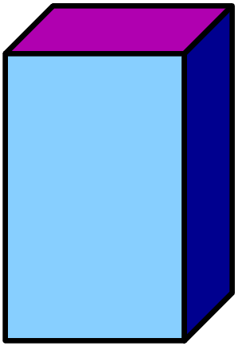

# Level 1 Heading = Section

## Level 2 Heading = Slide


This file, `template.md`, contains an example of how to use markdown to:
. . .
  * create a slide
  * create a section
  * create a list
  * create column layout
  * create boxes
  * create syntax-highlighted code
  * include a picture
  * center a line of text
  * specify incremental reveal
. . .
The theme settings are all in the file `template.theme`.


# Another Section

## A Slide About Emphasis

**Bold text**

*Italic text*

~~Strikethough text~~

->Centered text<-

****Alert text****

.

> This here is a block
> quote. The quick brown fox jumped over the lazy dog.
> The quick brown fox jumped over the lazy dog.
> The quick brown fox jumped over the lazy dog.
> The quick brown fox jumped over the lazy dog.
> The quick brown fox jumped over the lazy dog.


## Another level 

### Level 3 Heading = Box 

Here's a numbered list:

 1. First item

 2. Next item

. . .

#### Level >= 4 Heading = Nested Box

Rarely seen.

## Code with Syntax Highlighting

 1. Python code:
 
    ```python
    s="some text"
    print(s) 
    ```
 2. R code:
 
    ```r
    a <- c(1,2)
    print(a)
    ```

## Pictures

[[

One with a caption:

{height=70%}

||

One without a caption:

{height=70%}

]]

## Columns

[[

Left column

Columns cannot be nested, but otherwise they can still contain other
markdonw.
. . .
||

Middle column

This contains an image

->{height=50%}<-
. . .
||

Right column

This one contains some C code:

```c
int main()
{
    return 0;
}
```

]]
. . .
Did you notice the pauses between the columns?


## A Table

+-----------------+-----------------+-----------------+
| Column header 1 | Column header 2 | Column header 3 |
+=================+=================+=================+
|   A             |    B            |           C     |
+-----------------+-----------------+-----------------+
|   D             |    E            |           F     |
+-----------------+-----------------+-----------------+


## Link

Where is the slide with the title ****[a table]****?

Link to a site like ****<https://www.google.com>****.

Link with a different text: ****[bla bla](https://www.google.com)****.


# The End

