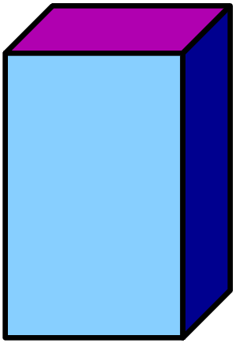

# Introduction Section

## A slide


The file `template.md` contains an example of how to use markdown to:
. . .
  * create a slide
  * create a section
  * create a list
  * create column layout
  * create boxes
  * create syntax-highlighted code
  * include a picture
  * center a line of text
  * specify incremental reveal
. . .
The theme settings are all in the file `template.theme`.


# Another Section

## This is a slide 

### Box Title

[[

Code in one column:
. . .
 1. Python code:
 
    ```python
    s="some text"
    print(s) 
    ```
 2. R code:
 
    ```r
    a <- c(1,2)
    print(a)
    ```

||

. . .
->A picture in the other column<-


->{width=50%}<-

]]

# The End

